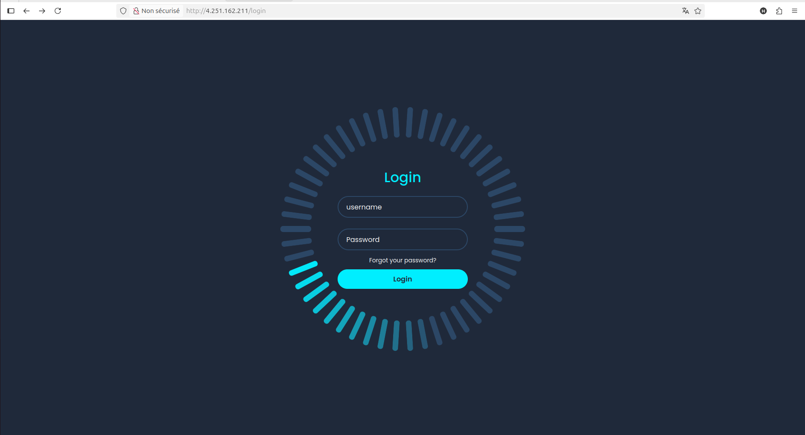
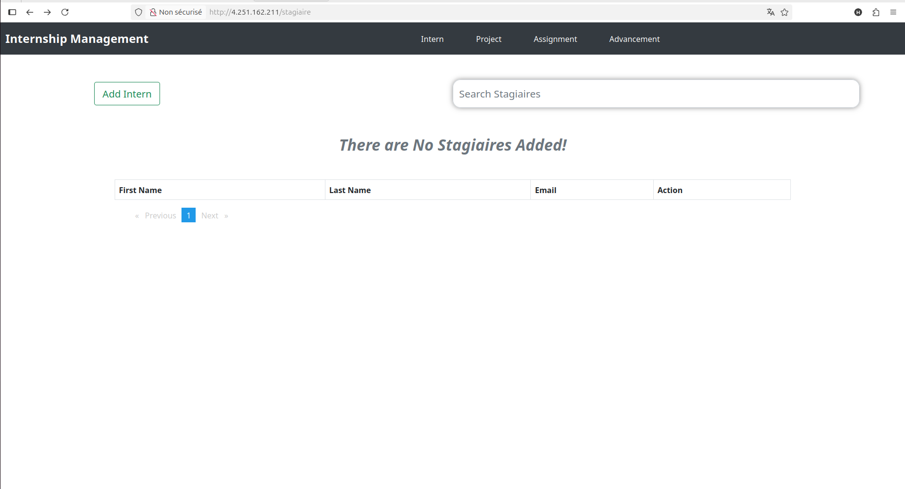

# 🎓 Internship Management System

A full-stack web application for managing internships, built with modern technologies and deployed on Azure Kubernetes Service (AKS).




## 🚀 Features

- **🔐 User Authentication** - Secure login system
- **👥 Intern Management** - CRUD operations for interns (stagiaires)
- **📊 Dashboard** - Overview of all internships
- **☁️ Cloud Native** - Deployed on Azure Kubernetes Service (AKS)
- **🔄 CI/CD Pipeline** - Automated deployment with GitHub Actions
- **📱 Responsive Design** - Works on all devices

## 🏗️ Architecture
Frontend (Angular) → Backend (Spring Boot) → Database (MySQL) 
↓ ↓ ↓
Nginx Server Spring Boot REST API MySQL 8.0
↓ ↓ ↓
Kubernetes Pod Kubernetes Pod Kubernetes Pod
↓ ↓ ↓
Azure AKS Cluster + Load Balancer

## 🛠️ Technology Stack

### Frontend
- **Angular 15+** - Frontend framework
- **TypeScript** - Programming language
- **Bootstrap 5** - UI components
- **HTML5/CSS3** - Markup and styling

### Backend
- **Spring Boot 3.3.2** - Java framework
- **Spring Data JPA** - Database operations
- **Spring Security** - Authentication & Authorization
- **Maven** - Dependency management

### Database
- **MySQL 8.0** - Relational database
- **JPA/Hibernate** - ORM framework

### Infrastructure & DevOps
- **Azure Kubernetes Service (AKS)** - Container orchestration
- **Docker** - Containerization
- **GitHub Actions** - CI/CD pipeline
- **Azure Container Registry** - Docker image storage
- **Nginx** - Web server & reverse proxy


## 🚀 Deployment Architecture

### Kubernetes Services
- **frontend-service**: LoadBalancer (Port 80)
- **backend-service**: ClusterIP (Port 9090) 
- **mysql-service**: ClusterIP (Port 3306)

### Persistent Storage
- **MySQL PVC**: Persistent Volume Claim for data persistence

### Health Monitoring
- **Liveness & Readiness Probes**: Application health checks
- **Spring Boot Actuator**: Application metrics and health

## 🔧 Installation & Setup

### Prerequisites
- Azure account with AKS cluster
- Docker Hub account
- MySQL database

### Local Development
```bash
# Backend
cd backend
mvn spring-boot:run

# Frontend  
cd frontend
npm install
ng serve
Production Deployment

The application is automatically deployed via GitHub Actions on push to main branch.
⚙️ Configuration
Environment Variables
yaml

# Backend Configuration
SPRING_DATASOURCE_URL: jdbc:mysql://mysql-service:3306/internshipdb
SPRING_DATASOURCE_USERNAME: root
SPRING_DATASOURCE_PASSWORD: password
SERVER_PORT: 9090

# Frontend Configuration
API_BASE_URL: /api
Kubernetes Manifests

    Deployments: Application pod definitions

    Services: Network access configuration

    Secrets: Secure credential management

    ConfigMaps: Application configuration

🔄 CI/CD Pipeline
GitHub Actions Workflow

    Code Push → Triggers pipeline

    Build Images → Docker image creation

    Push to Registry → Docker Hub storage

    Deploy to AKS → Kubernetes deployment

    Health Checks → Application verification
Pipeline Steps

    ✅ Code checkout

    ✅ Docker image build & push

    ✅ Azure authentication

    ✅ Kubernetes configuration

    ✅ Database deployment

    ✅ Backend deployment

    ✅ Frontend deployment

    ✅ Verification checks

🌐 Access URLs

    Application: http://4.251.162.211

    Backend API: http://4.251.162.211/api

    Health Check: http://4.251.162.211/api/actuator/health

🛡️ Security Features

    CORS Configuration: Cross-origin resource sharing

    Input Validation: Data sanitization

    Secret Management: Kubernetes secrets for credentials

    Network Policies: Isolated pod communication

📈 Monitoring & Logging

    Spring Boot Actuator: Application metrics

    Kubernetes Logs: Container logging

    Health Endpoints: /actuator/health

    Custom Logging: Application-specific logs

🤝 Contributing

    Fork the project

    Create your feature branch (git checkout -b feature/AmazingFeature)

    Commit your changes (git commit -m 'Add some AmazingFeature')

    Push to the branch (git push origin feature/AmazingFeature)

    Open a Pull Request

🙏 Acknowledgments

    Azure Cloud Services

    Spring Boot Team

    Angular Team

    Kubernetes Community

```markdown
🚀 Je suis fier d'annoncer le déploiement réussi de mon application de Gestion de Stages sur Azure Kubernetes Service (AKS) ! 🎓

J'ai développé une application full-stack complète pour la gestion des stagiaires, avec une architecture cloud-native moderne :

🛠️ **Stack Technique :**
• Frontend : Angular avec Bootstrap
• Backend : Spring Boot 3.3.2 (Java)
• Base de données : MySQL 8.0
• Infrastructure : Azure Kubernetes Service (AKS)
• CI/CD : GitHub Actions
• Conteneurisation : Docker

📊 **Architecture Cloud Native :**
L'application est déployée sur AKS avec une architecture microservices :
• Load Balancer pour le frontend
• Services ClusterIP pour la communication interne
• Persistent Volume pour la base de données
• Health checks avec Spring Boot Actuator

🔄 **Pipeline CI/CD Automatisé :**
Chaque push sur la branche main déclenche un déploiement automatique :
✅ Build des images Docker
✅ Push vers Docker Hub  
✅ Déploiement sur AKS
✅ Tests de santé des applications


*Interface moderne de gestion des stagiaires*

 
*Pipeline CI/CD avec GitHub Actions*


*Statut de déploiement réussi sur Azure*

🎯 **Fonctionnalités Clés :**
• Authentification sécurisée
• CRUD complet des stagiaires
• Interface responsive
• API RESTful
• Monitoring de santé
• Scaling horizontal

🌐 **Application accessible à :** http://4.251.162.211

Ce projet m'a permis de maîtriser les technologies cloud modernes, les conteneurs Docker, l'orchestration Kubernetes et les pipelines DevOps automatisés.

#CloudComputing #Azure #Kubernetes #AKS #SpringBoot #Angular #DevOps #CI/CD #Docker #Microservices #Java #TypeScript #FullStack #CloudNative